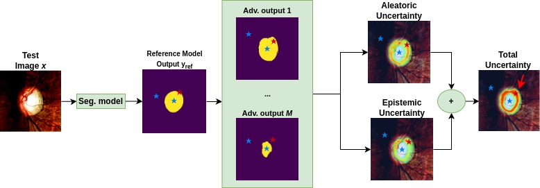

# quam_sm
post-hoc uncertainty quantification framework for medical image segmentation based on adversarial models that identifies fragile pixel-wise predictions.

QUAM-SM Overview: Following initial segmentation ($y_{ref}$), QUAM-SM utilizes post-hoc adversarial search across $M$ adversarial model outputs to identify predictive fragility. This fragility is decomposed into aleatoric and epistemic components and combined into a Total Uncertainty map, effectively distinguishing boundary instability (red star) from robust certain regions (blue stars).
