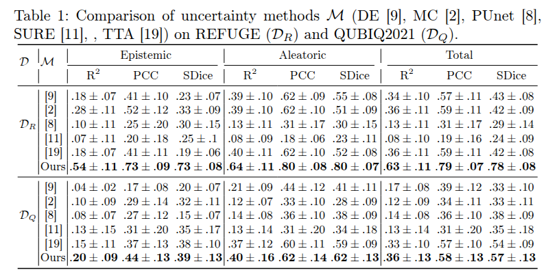
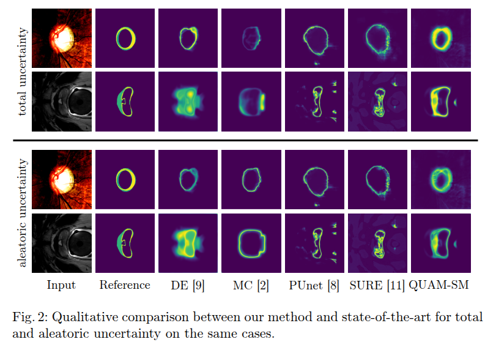

# quam_sm
Quantification of Uncertainty with Adversarial Models in Medical Image Segmentation

post-hoc uncertainty quantification framework for medical image segmentation based on adversarial models that identifies fragile pixel-wise predictions.

QUAM-SM Overview: Following initial segmentation ($y_{ref}$), QUAM-SM utilizes post-hoc adversarial search across $M$ adversarial model outputs to identify predictive fragility. This fragility is decomposed into aleatoric and epistemic components and combined into a Total Uncertainty map, effectively distinguishing boundary instability (red star) from robust certain regions (blue stars).

## Performance Benchmarking

We evaluate **QUAM-SM** against five state-of-the-art uncertainty quantification methods across two multi-annotator datasets: **REFUGE2** ($\mathcal{D}_R$) and **QUBIQ2021** ($\mathcal{D}_Q$).

### Comparison Baselines
Our framework is benchmarked against the following established approaches:
* **DE [9] (Deep Ensembles):** Evaluates uncertainty through an ensemble of independently trained models.
* **MC [2] (Monte Carlo Dropout):** Samples the approximate posterior using dropout at inference time.
* **PUnet [8] (Probabilistic U-Net):** A generative approach that models conditional probability distributions.
* **SURE [11]:** A recent evidential deep learning framework for robust segmentation.
* **TTA [19] (Test-Time Augmentation):** A post-hoc method aggregating results from multiple image transformations.

### Results Summary
The quantitative results demonstrate that **QUAM-SM** provides a superior characterization of predictive instability compared to traditional stochastic or evidential methods:

* **State-of-the-Art Correlation:** In the REFUGE dataset, our method achieves an **Aleatoric PCC of 0.80**, significantly surpassing the next best baseline, TTA (0.62), and nearly tripling the performance of generative models like PUnet (0.31).
* **Disentanglement Quality:** Across both datasets, QUAM-SM consistently yields higher $R^2$ and PCC values for both **Epistemic** and **Aleatoric** components, proving its efficacy in distinguishing between model-based uncertainty and inherent data ambiguity.
* **Segmentation Accuracy:** Our method maintains the highest **SDice (Soft Dice)** scores across all uncertainty types, notably reaching **0.78 total SDice** on REFUGE and **0.57** on QUBIQ, outperforming the competition in both reliability and mask quality.
* **Robustness:** Even in the challenging QUBIQ prostate tumor dataset, QUAM-SM achieves a **Total PCC of 0.58**, showing strong resilience across diverse modalities (CFP and MRI).

